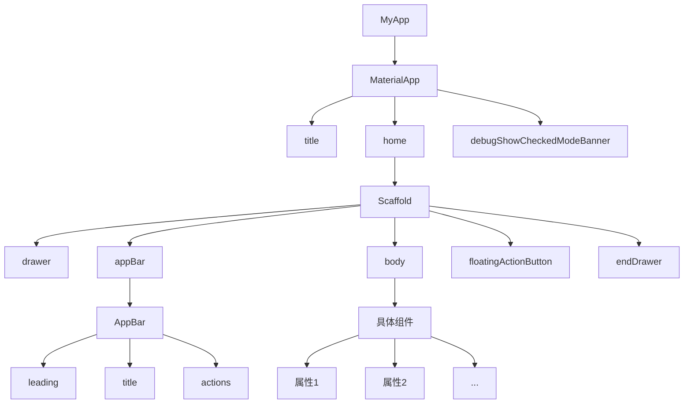

# Flutter学习

[toc]

Flutter中一切内容都是组件（Widget）

- 无状态组件（StatelessWidget）
- 有状态组件（StatefulWidget）

## 初始化项目

### 创建项目

1. `flutter create myporject`
2. `cd myproject`
3. `flutter run`

### 项目目录

```
flutter_app
|--- android               # 安卓目录
|--- build                 # 构建目录
|--- ios                   # ios目录
|--- lib                   # 开发目录，相当于src目录
|------ mian.dart          # 入口文件，相当于index.js
|--- test                  # 测试目录
|------ .gitignore         # Git提交忽略文件
|--- pubspec.lock          # 项目依赖锁定信息（相当于npm中的package-lock.json）
|--- pubspec.yaml          # 项目依赖配置（相当于npm中的package.json）
```

### Material Desgin

Google推出的前端UI解决方案

官网：https://m3.material.io/

中文网：https://www.mdui.org/design/

## APP 结构

1. MaterialApp - Material Design提供的骨架

- title（任务管理器中的标题）
- home（主内容）
- debugShowCheckedModeBanner（是否显示左上角调试标记）

2. Scaffold - 脚手架（骨架）

- appBar（应用头部）
- body（应用主体）
- floatingActionButton（浮动按钮）
- drawer（左侧抽屉菜单）
- endDrawer（右侧抽屉菜单）



MaterialApp 可以看成顶级组件

Scaffold 骨架组件，支撑了APP的骨架

头部的AppBar

body的具体组件

## 基础组件

### Text（文本）

- TextDirection 文本方向
- TextStyle 文本样式
  - Colors 文本颜色
  - FontWeight 字体粗细
  - FontStyle 字体样式
- TextAlign 文本对齐
- TextOverflow 文本溢出
- maxLines 指定显示的行数

RichText 与 TextSpan 一般组合在一起使用，作用是给一段文本声明多个不同的样式。

```dart
  Widget build(BuildContext context) {
    return Column(
      children: [
        const Text(
          "我们在 YouTube 上有一个 Flutter 频道，欢迎订阅！更多视频和播放列表介绍，以及社区制作的视频教程，可以查看我们的 Flutter 技术视频资源 页面。同时，你可以关注 “Google中国”的哔哩哔哩账号 了解更多更全面的谷歌技术中文内容，也可以关注 “Flutter 社区”的哔哩哔哩账号 了解更多来自社区的内容更新。",
          textDirection: TextDirection.ltr,
          style: TextStyle(
            fontSize: 30,
            color: Colors.red,
            fontWeight: FontWeight.w500,
            fontStyle: FontStyle.italic,
            decoration: TextDecoration.lineThrough,
            decorationColor: Colors.blue,
          ),
          textAlign: TextAlign.left,
          maxLines: 3,
          overflow: TextOverflow.ellipsis,
          textScaler: TextScaler.linear(1.5),
        ),
        RichText(
            text: const TextSpan(
                text: "Hello",
                style: TextStyle(fontSize: 40, color: Colors.red),
                children: [
                  TextSpan(
                    text: "Flutter",
                    style: TextStyle(fontSize: 40, color: Colors.blue),
                  ),
                  TextSpan(
                    text: "你好世界",
                    style: TextStyle(fontSize: 30, color: Colors.black45),
                  )
                ]
            )
        )
      ],
    );
  }
```

#### 设置定义字体

下载并导入字体

- Google Fonts：https://fonts.google.com/

- 将下载的字体文件复制到Flutter项目中

在 pubspec.yaml 中声明字体，基本语法：

```yaml
flutter:
	fonts:
		# family 属性决定了字体的名称，会在 TextStyle 的 fontFamily 属性中用到。
		- family: SourceSansPro
			fonts：
				- assets: fonts/Source_Sans_Pro/SourceSans3-Black.ttf
				- assets: fonts/Source_Sans_Pro/SourceSans3-BlackItalic.ttf
					# weight 属性指定了文件中字体轮廓的字重为 100 的整数倍
					weight: 400
					# style 属性指定了文件中字体的轮廓是否为 italic 或 normal
					style: normal
```

### Icon（图标）

Icon图标也是由Material Desgin icon图标库提供

使用方式：

- Icon(Icons.具体名称)

项目中自动给我们集成了Material Desgin的Icon图标库，所以无需额外的下载或配置

### Color（颜色）

Flutter 中通过 ARGB 来来声明颜色。

自定义颜色，下面是自定义颜色的方式：

- const Color(0xFF42A5F5); // 16进制(0x)的ARGB = 透明度(FF) + 六位十六进制颜色值(42A5F5)
- const Color.fromARGB(0xFF, 0x42, 0xA5, 0xF5)
- const Color.fromARGB(255, 66, 165, 245)
- const Color.fromRGBO(66, 165, 245, 1.0) // O = Opacity

Colors 英文字母声明的颜色：

- Colors.red

