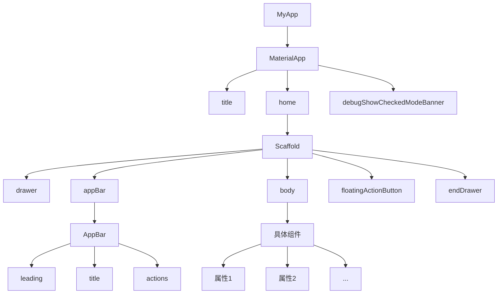

# Flutter学习

[toc]

Flutter中一切内容都是组件（Widget）

- 无状态组件（StatelessWidget）
- 有状态组件（StatefulWidget）

## 初始化项目

### 创建项目

1. `flutter create myporject`
2. `cd myproject`
3. `flutter run`

### 项目目录

```
flutter_app
|--- android               # 安卓目录
|--- build                 # 构建目录
|--- ios                   # ios目录
|--- lib                   # 开发目录，相当于src目录
|------ mian.dart          # 入口文件，相当于index.js
|--- test                  # 测试目录
|------ .gitignore         # Git提交忽略文件
|--- pubspec.lock          # 项目依赖锁定信息（相当于npm中的package-lock.json）
|--- pubspec.yaml          # 项目依赖配置（相当于npm中的package.json）
```

### Material Desgin

Google推出的前端UI解决方案

官网：https://m3.material.io/

中文网：https://www.mdui.org/design/

## APP 结构

1. MaterialApp - Material Design提供的骨架

- title（任务管理器中的标题）
- home（主内容）
- debugShowCheckedModeBanner（是否显示左上角调试标记）

2. Scaffold - 脚手架（骨架）

- appBar（应用头部）
- body（应用主体）
- floatingActionButton（浮动按钮）
- drawer（左侧抽屉菜单）
- endDrawer（右侧抽屉菜单）



MaterialApp 可以看成顶级组件

Scaffold 骨架组件，支撑了APP的骨架

头部的AppBar

body的具体组件

## 基础组件

### Text（文本）

- TextDirection 文本方向
- TextStyle 文本样式
  - Colors 文本颜色
  - FontWeight 字体粗细
  - FontStyle 字体样式
- TextAlign 文本对齐
- TextOverflow 文本溢出
- maxLines 指定显示的行数

RichText 与 TextSpan 一般组合在一起使用，作用是给一段文本声明多个不同的样式。

```dart
  Widget build(BuildContext context) {
    return Column(
      children: [
        const Text(
          "我们在 YouTube 上有一个 Flutter 频道，欢迎订阅！更多视频和播放列表介绍，以及社区制作的视频教程，可以查看我们的 Flutter 技术视频资源 页面。同时，你可以关注 “Google中国”的哔哩哔哩账号 了解更多更全面的谷歌技术中文内容，也可以关注 “Flutter 社区”的哔哩哔哩账号 了解更多来自社区的内容更新。",
          textDirection: TextDirection.ltr,
          style: TextStyle(
            fontSize: 30,
            color: Colors.red,
            fontWeight: FontWeight.w500,
            fontStyle: FontStyle.italic,
            decoration: TextDecoration.lineThrough,
            decorationColor: Colors.blue,
          ),
          textAlign: TextAlign.left,
          maxLines: 3,
          overflow: TextOverflow.ellipsis,
          textScaler: TextScaler.linear(1.5),
        ),
        RichText(
            text: const TextSpan(
                text: "Hello",
                style: TextStyle(fontSize: 40, color: Colors.red),
                children: [
                  TextSpan(
                    text: "Flutter",
                    style: TextStyle(fontSize: 40, color: Colors.blue),
                  ),
                  TextSpan(
                    text: "你好世界",
                    style: TextStyle(fontSize: 30, color: Colors.black45),
                  )
                ]
            )
        )
      ],
    );
  }
```

#### 设置定义字体

下载并导入字体

- Google Fonts：https://fonts.google.com/

- 将下载的字体文件复制到Flutter项目中

在 pubspec.yaml 中声明字体，基本语法：

```yaml
flutter:
	fonts:
		# family 属性决定了字体的名称，会在 TextStyle 的 fontFamily 属性中用到。
		- family: SourceSansPro
			fonts：
				- assets: fonts/Source_Sans_Pro/SourceSans3-Black.ttf
				- assets: fonts/Source_Sans_Pro/SourceSans3-BlackItalic.ttf
					# weight 属性指定了文件中字体轮廓的字重为 100 的整数倍
					weight: 400
					# style 属性指定了文件中字体的轮廓是否为 italic 或 normal
					style: normal
```

### Icon（图标）

Icon图标也是由Material Desgin icon图标库提供

使用方式：

- Icon(Icons.具体名称)

  ```dart
  Icon(Icons.menu)
  ```

项目中自动给我们集成了Material Desgin的Icon图标库，所以无需额外的下载或配置

### Color（颜色）

Flutter 中通过 ARGB 来来声明颜色。

自定义颜色，下面是自定义颜色的方式：

- const Color(0xFF42A5F5); // 16进制(0x)的ARGB = 透明度(FF) + 六位十六进制颜色值(42A5F5)
- const Color.fromARGB(0xFF, 0x42, 0xA5, 0xF5)
- const Color.fromARGB(255, 66, 165, 245)
- const Color.fromRGBO(66, 165, 245, 1.0) // O = Opacity

Colors 英文字母声明的颜色：

- Colors.red

```dart
RichText(
    text: TextSpan(
        text: "Hello",
        style: const TextStyle(fontSize: 40, color: Color.fromRGBO(255, 0, 0, 1)),
        children: [
          TextSpan(
            text: "Flutter",
            style: TextStyle(fontSize: 40, color: Colors.blue),
          ),
          const TextSpan(
            text: "你好世界",
            style: TextStyle(fontSize: 30, color: Color.fromARGB(0xff, 0x00, 0xff, 0x00)),
          )
        ]
    )
)
```

### Container（布局容器）

chlid 声明子组件

padding（margin）

- EdgeInsets （all(), fromLTRB(), only()）

decoration

- BoxDecoration (边框，圆角，渐变，阴影，背景色，背景图片)

alignment

- Alignment （内容对齐）

transform

- Matrix4 （平移-translate，旋转-rotate，缩放-scale，斜切-skew）

```dart
class ContainerDemo extends StatelessWidget {
  const ContainerDemo({super.key});

  @override
  Widget build(BuildContext context) {
    return Container(
      width: 200,
      height: 200,
      // width: double.infinity, // 占满父容器宽度
      // height: double.infinity, // 占满父容器高度
      padding: const EdgeInsets.all(10),
      margin: const EdgeInsets.fromLTRB(10, 30, 0, 5),
      decoration: BoxDecoration(
        border: Border.all(color: Colors.red, width: 10),
        // border: Border(
        //   top: BorderSide(color: Colors.red, width: 10),
        //   bottom: BorderSide(color: Colors.red, width: 10),
        //   left: BorderSide(color: Colors.red, width: 10),
        //   right: BorderSide(color: Colors.red, width: 10),
        // ),
        // borderRadius必须在boder颜色均匀(四边颜色一直)时才会生效
        // borderRadius: BorderRadius.all(Radius.circular(10)),
        borderRadius: const BorderRadius.only(
          topLeft: Radius.circular(30)
        ),
        color: Colors.lightGreen[100],
        gradient: const LinearGradient(colors: [Colors.lightBlue, Colors.white12]), // 设置了渐变之后，背景色color会失效
      ),
      alignment: Alignment.center,
      // transform: Matrix4.translationValues(100, 0, 0), // 平移
      // transform: Matrix4.rotationZ(-0.1), // 旋转
      transform: Matrix4.skewX(0.2), // 斜切
      child: const Text(
        "我们在 YouTube 上有一个 Flutter 频道，欢迎订阅！更多视频和播放列表介绍，以及社区制作的视频教程，可以查看我们的 Flutter 技术视频资源 页面。",
        style: TextStyle(fontSize: 20),
      )
    );
  }
}
```

### Column & Row（线性布局）

Column

Column 中的主轴方向是垂直方向

- mainAxisAlignment：MainAxisAlignment 主轴对齐方式
- crossAxisAlignment：CrossAxisAlignment 交叉轴对齐方式
- children：内容

Row

Row中主轴方向是水平方向

- 属性与Column一致

```dart
class ColumnRowDemo extends StatelessWidget {
  const ColumnRowDemo({super.key});

  @override
  Widget build(BuildContext context) {
    return Container(
      width: double.infinity,
      color: Colors.lightGreen,
      child: const Column(
        mainAxisAlignment: MainAxisAlignment.spaceEvenly, // 主轴的对齐方式
        crossAxisAlignment: CrossAxisAlignment.center,
        children: [
          Icon(Icons.access_alarm, size: 50),
          Icon(Icons.accessible_forward_outlined, size: 50),
          Icon(Icons.settings, size: 50),
          Icon(Icons.add_box, size: 50),
          Row(
            mainAxisAlignment: MainAxisAlignment.center,
            children: [
              Icon(Icons.access_alarm, size: 50),
              Icon(Icons.accessible_forward_outlined, size: 50),
              Icon(Icons.settings, size: 50),
              Icon(Icons.add_box, size: 50),
            ],
          )
        ],
      ),
    );
  }
}
```

### Flex & Expanded（弹性布局）

Flex

- direction 声明主轴方向
- mainAxisAlignment 声明主轴对齐方式
- textDirection 声明水平方向的排列顺序
- crossAxisAlignment 声明交叉轴对齐方式
- verticalDirection 声明垂直方向的排列顺序
- children 声明子组件

Expanded 可伸缩组件

- flex 声明弹性布局所占比例
- child 声明子组件

```dart
class FlexDemo extends StatelessWidget {
  const FlexDemo({super.key});

  @override
  Widget build(BuildContext context) {
    return Column(
      children: [
        // 验证Expanded
        Row(
          children: [
            Container(
              color: Colors.lightBlue,
              width: 50,
              height: 50,
            ),
            Expanded(
                child: Container(
              color: Colors.lightGreen,
              height: 50,
            ))
          ],
        ),
        const Flex(
          direction: Axis.horizontal,
          mainAxisAlignment: MainAxisAlignment.spaceAround,
          textDirection: TextDirection.rtl, // 声明水平方向排列方式
          children: [
            Icon(Icons.access_alarm, size: 50),
            Icon(Icons.accessible_forward_outlined, size: 50),
            Icon(Icons.settings, size: 50),
            Icon(Icons.add_box, size: 50),
          ],
        ),
        Flex(
          direction: Axis.horizontal,
          children: [
            Expanded(
              child: Container(
                color: Colors.tealAccent,
                height: 50,
              ),
              flex: 2,
            ),
            Expanded(
              child: Container(
                color: Colors.amberAccent,
                height: 50,
              ),
              flex: 1,
            )
          ],
        ),
        Container(
          height: 100,
          margin: EdgeInsets.all(50),
          child: Flex(
            direction: Axis.vertical,
            // verticalDirection: VerticalDirection.up, // 垂直方向排列顺序
            children: [
              Expanded(
                child: Container(
                  color: Colors.tealAccent,
                  height: 50,
                ),
                flex: 2,
              ),
              // 空行占位
              Spacer(
                flex: 1,
              ),
              Expanded(
                child: Container(
                  color: Colors.amberAccent,
                  height: 50,
                ),
                flex: 1,
              )
            ],
          ),
        )
      ],
    );
  }
}
```

### Wrap (流式布局)

Wrap（解决内容溢出的问题）

- spacing 主轴方向子组件的间距
- alignment 主轴方向的对齐方式
- runSpacing 纵轴方向子组件的间距
- runAlignment 纵轴方向的对齐方式

顺带学的小组件：Chip（标签），CircleAvatar（圆形头像）

```dart
class WrapDemo extends StatelessWidget {
  const WrapDemo({super.key});

  @override
  Widget build(BuildContext context) {
    List<String> _list = [
      '曹操', '司马懿', '曹仁', '曹洪', '张辽', '许诸'
    ];

    List<Chip> _weiGuo() {
      return _list.map((item){
        return Chip(
          avatar: const CircleAvatar(
            backgroundColor: Colors.black,
            child: Text("魏", style: TextStyle(fontSize: 12, color: Colors.white),),
          ),
          label: Text(item),
        );
      }).toList();
    }

    return Column(
      mainAxisAlignment: MainAxisAlignment.spaceEvenly,
      children: [
        Wrap(
          spacing: 18, // 水平间距
          runSpacing: 15, // 垂直间距
          alignment: WrapAlignment.spaceAround, // 主轴对齐方式
          // runAlignment: WrapAlignment.spaceAround, // 交叉轴对齐方式【已经在column里了，效果不是很明显】
          children: _weiGuo(),
        ),
        const Wrap(
          children: [
            Chip(
              avatar: CircleAvatar(
                backgroundColor: Colors.blue,
                child: Text("蜀"),
              ),
              label: Text("刘备"),
            ),
            Chip(
              avatar: CircleAvatar(
                backgroundColor: Colors.blue,
                child: Text("蜀"),
              ),
              label: Text("张飞"),
            ),
            Chip(
              avatar: CircleAvatar(
                backgroundColor: Colors.blue,
                child: Text("蜀"),
              ),
              label: Text("关羽"),
            ),
            Chip(
              avatar: CircleAvatar(
                backgroundColor: Colors.blue,
                child: Text("蜀"),
              ),
              label: Text("赵云"),
            ),
            Chip(
              avatar: CircleAvatar(
                backgroundColor: Colors.blue,
                child: Text("蜀"),
              ),
              label: Text("诸葛亮"),
            ),
            Chip(
              avatar: CircleAvatar(
                backgroundColor: Colors.blue,
                child: Text("蜀"),
              ),
              label: Text("黄忠"),
            )
          ],
        )
      ],
    );
  }
}
```

### Stack（层叠布局）

Stack 层叠组件 - 类似css中的 z-index

- alignment 声明未定位子组件的对齐方式
- textDirection 声明未定位子组件的排列顺序

Positioned 绝对定位组件

- child 声明子组件
- left，top，right，bottom
- width，height

顺带学的组件：NetworkImage 网络图片组件

- NetworkImage('网络图片地址')
- 配置网络权限: `<uses-permission android:name="android.permission.INTERNET"/>`

```dart
class StackDemo extends StatelessWidget {
  const StackDemo({super.key});

  @override
  Widget build(BuildContext context) {
    return Container(
      child: Stack(
        // 声明未定位子组件排序方式
        textDirection: TextDirection.rtl,
        // 声明未定位子组件对齐方式
        alignment: AlignmentDirectional.bottomCenter,
        children: [
          const CircleAvatar(
            backgroundImage: NetworkImage(
                'https://himg.bdimg.com/sys/portrait/item/public.1.f02d5419.4lnYMc1vGvDDmM9ZRgs5JQ.jpg'),
            radius: 200,
          ),
          Positioned(
            top: 50,
            right: 40,
            child: Container(
              color: Colors.red,
              padding: const EdgeInsets.all(10),
              child: const Text(
                '热卖',
                style: TextStyle(color: Colors.white, fontSize: 20),
              ),
            ),
          ),
          const Text(
            'Hello',
            style: TextStyle(color: Colors.white, fontSize: 50),
          ),
        ],
      ),
    );
  }
}
```

### Card（卡片）

Card 卡片

- child 子组件
- color 背景色
- shadowColor 阴影色
- elevation 阴影高度
- shape 边框样式
- margin 外边距

ListTile 列表瓦片

- leading 头部组件
- title 标题
- subtitle 子标题

```dart
class CardDemo extends StatelessWidget {
  const CardDemo({super.key});

  @override
  Widget build(BuildContext context) {
    return Column(
      children: [
        Card(
          margin: EdgeInsets.all(30),
          color: Colors.purpleAccent[100],
          shadowColor: Colors.yellow,
          elevation: 20,
          shape: RoundedRectangleBorder(
              borderRadius: BorderRadius.circular(40),
              side: BorderSide(color: Colors.yellow, width: 3)),
          child: Column(
            children: [
              ListTile(
                leading: Icon(Icons.supervised_user_circle, size: 50),
                title: Text(
                  "张三",
                  style: TextStyle(fontSize: 30),
                ),
                subtitle: Text(
                  "董事长",
                  style: TextStyle(fontSize: 20),
                ),
              ),
              Divider(),
              ListTile(
                title: Text(
                  "电话: 13333333333",
                  style: TextStyle(fontSize: 20),
                ),
              ),
              ListTile(
                title: Text(
                  "地址:xxxxxxxx",
                  style: TextStyle(fontSize: 20),
                ),
              )
            ],
          ),
        ),
        Card(
          margin: EdgeInsets.all(30),
          child: Column(
            children: [
              ListTile(
                leading: Icon(Icons.supervised_user_circle, size: 50),
                title: Text(
                  "李四",
                  style: TextStyle(fontSize: 30),
                ),
                subtitle: Text(
                  "总经理",
                  style: TextStyle(fontSize: 20),
                ),
              ),
              Divider(),
              ListTile(
                title: Text(
                  "电话: 13333333333",
                  style: TextStyle(fontSize: 20),
                ),
              ),
              ListTile(
                title: Text(
                  "地址:xxxxxxxx",
                  style: TextStyle(fontSize: 20),
                ),
              )
            ],
          ),
        )
      ],
    );
  }
}
```

### Button（按钮）

```dart
import 'package:flutter/material.dart';

class Home extends StatelessWidget {
  const Home({super.key});

  @override
  Widget build(BuildContext context) {
    return Scaffold(
      appBar: AppBar(
          title: const Text("首页"),
          leading: const Icon(Icons.menu),
          actions: const [Icon(Icons.settings)],
          elevation: 1,
          centerTitle: true),
      body: const ButtonDemo(),
      floatingActionButton: FloatingActionButton(
        onPressed: (){},
        tooltip: "Increment",
        child: Icon(Icons.add),
        backgroundColor: Colors.green,
        foregroundColor: Colors.white,
        elevation: 0,
      ),
    );
  }
}

class ButtonDemo extends StatelessWidget {
  const ButtonDemo({super.key});

  @override
  Widget build(BuildContext context) {
    return Container(
      padding: const EdgeInsets.all(10),
      child: Wrap(
        children: [
          TextButton(
              onPressed: () {
                print('点击 TextButton');
              },
              onLongPress: () {
                print('长按 TextButton');
              },
              child: const Text('TextButton')),
          ElevatedButton(
              onPressed: () {
                print('点击 ElevatedButton');
              },
              onLongPress: () {
                print('长按 ElevatedButton');
              },
              child: const Text('ElevatedButton')),
          OutlinedButton(
              onPressed: () {
                print('点击 OutlinedButton');
              },
              onLongPress: () {
                print('长按 OutlinedButton');
              },
              child: const Text('OutlinedButton')),
          OutlinedButton(
              onPressed: () {
                print('点击 OutlinedButton');
              },
              onLongPress: () {
                print('长按 OutlinedButton');
              },
              style: ButtonStyle(
                  textStyle:
                      MaterialStateProperty.all(const TextStyle(fontSize: 30)),
                  foregroundColor: MaterialStateProperty.resolveWith((states) {
                    // 按下按钮时的前景色
                    if (states.contains(MaterialState.pressed)) {
                      return Colors.red;
                    }
                    return Colors.blue;
                  }),
                  backgroundColor: MaterialStateProperty.resolveWith((states) {
                    // 按下按钮时的前景色
                    if (states.contains(MaterialState.pressed)) {
                      return Colors.yellow;
                    }
                    return Colors.white;
                  }),
                  shadowColor: MaterialStateProperty.all(Colors.yellow),
                  elevation: MaterialStateProperty.all(20),
                  // 边框
                  side: MaterialStateProperty.all(
                      const BorderSide(color: Colors.green, width: 2)),
                  // 按钮形状
                  shape: MaterialStateProperty.all(const StadiumBorder(
                      side: BorderSide(color: Colors.green, width: 2))),
                  // 按钮大小
                  maximumSize: MaterialStateProperty.all(const Size(180, 90)),
                  // 水波纹效果
                  overlayColor: MaterialStateProperty.all(Colors.purple)),
              child: const Text('轮廓按钮')),
          OutlinedButtonTheme(
            data: OutlinedButtonThemeData(
                style: ButtonStyle(
                    overlayColor: MaterialStateProperty.all(Colors.red))),
            child: OutlinedButton(
              onPressed: () {
                print('点击 OutlinedButton');
              },
              onLongPress: () {
                print('长按 OutlinedButton');
              },
              style: ButtonStyle(
                  // 样式中声明的样式如果和主题中重复，则主题中的不生效
                  overlayColor: MaterialStateProperty.all(Colors.red)),
              child: const Text('OutlinedButton'),
            ),
          ),
          // 图标按钮
          IconButton(
              onPressed: () {
                print('IconButton');
              },
              color: Colors.red,
              splashColor: Colors.lightBlue,
              highlightColor: Colors.purple,
              tooltip: "怎么了", // 长按会出现
              icon: Icon(Icons.add_alarm)),
          TextButton.icon(
              onPressed: () {
                print('文本按钮 icon');
              },
              icon: Icon(Icons.add_circle),
              label: Text("文本按钮")),
          ElevatedButton.icon(
              onPressed: () {
                print('凸起按钮 icon');
              },
              icon: Icon(Icons.add_circle),
              label: Text("凸起按钮")),
          OutlinedButton.icon(
              onPressed: () {
                print('轮廓按钮 icon');
              },
              icon: Icon(Icons.add_circle),
              label: Text("轮廓按钮")),
          // 按钮组
          Container(
            color: Colors.pink,
            width: double.infinity,
            // 按钮默认横向排列，当按钮显示不下时，会垂直排列
            child: ButtonBar(
              children: [
                ElevatedButton(
                    onPressed: () {
                      print("按钮一");
                    },
                    child: Text("按钮一")),
                ElevatedButton(
                    onPressed: () {
                      print("按钮一");
                    },
                    child: Text("按钮一")),
                ElevatedButton(
                    onPressed: () {
                      print("按钮一");
                    },
                    child: Text("按钮一")),
              ],
            ),
          ),
          BackButton(
            color: Colors.red,
            onPressed: () {
              print("回退按钮");
            },
          ),
          CloseButton(
            color: Colors.red,
            onPressed: () {
              print("关闭按钮");
            },
          )
        ],
      ),
    );
  }
}
```

### Image（图片）

Image.asset 加载本地图片

- 项目下创建一个图片存储目录
- 在 pubspec.yaml 中的 flutter 部分添加图片配置
- 在代码中加载图片

Image.network 加载网络图片

- 设置网络访问权限
- 允许http协议访问（默认只允许https）

```dart
class ImageDemo extends StatelessWidget {
  const ImageDemo({super.key});

  @override
  Widget build(BuildContext context) {
    return Column(
      children: [
        Image.asset(
          'images/bg1.jpg',
          width: 200,
          height: 200,
          fit: BoxFit.cover,
        ),
        Image.network(
          'https://himg.bdimg.com/sys/portrait/item/public.1.f02d5419.4lnYMc1vGvDDmM9ZRgs5JQ.jpg',
          repeat: ImageRepeat.repeat,
          color: Colors.green,
          colorBlendMode: BlendMode.colorDodge,
        )
      ],
    );
  }
}
```

### SingleChildScrollView（列表）

child 子组件

padding 内边距

scrollDirection 滚动方向：Axis.horizontal | Axis.vertical

reverse 初始滚动位置，false 头部 | true 尾部

physics：

- ClampingScrollPhysics：Android 下微光效果
- BouncingScrollPhysics：IOS下弹性效果

```dart
class SingleChildScrollViewDemo extends StatelessWidget {
  const SingleChildScrollViewDemo({super.key});

  @override
  Widget build(BuildContext context) {
    return Stack(
      children: [
        // 验证水平滚动
        SingleChildScrollView(
          scrollDirection: Axis.horizontal,
          padding: EdgeInsets.all(10),
          reverse: true,
          child: Row(
            children: [
              OutlinedButton(onPressed: () {}, child: Text("按钮一")),
              OutlinedButton(onPressed: () {}, child: Text("按钮二")),
              OutlinedButton(onPressed: () {}, child: Text("按钮三")),
              OutlinedButton(onPressed: () {}, child: Text("按钮四")),
              OutlinedButton(onPressed: () {}, child: Text("按钮五")),
              OutlinedButton(onPressed: () {}, child: Text("按钮六")),
            ],
          ),
        ),
        // 垂直方向
        SingleChildScrollView(
          scrollDirection: Axis.vertical,
          padding: EdgeInsets.all(10),
          reverse: false,
          physics: BouncingScrollPhysics(),
          child: Column(
            children: List.generate(100, (index) => OutlinedButton(onPressed: () {}, child: Text("按钮$index")))
          ),
        )
      ],
    );
  }
}
```

### ListView（列表）

ListView

- 加载列表组件（加载所有Widgets，使用Widgets比较少的场景）
- ListTitle（leading，title，subtitle，trailing，selected）

ListView.builder

- 按需加载Widget，性能比默认构造函数要高，使用Widget较多的场景

ListView.separated

- 比 ListVIew.builder 多了分隔器

```dart
import 'package:flutter/material.dart';

class Home extends StatelessWidget {
  const Home({super.key});

  @override
  Widget build(BuildContext context) {
    return Scaffold(
      appBar: AppBar(
          title: const Text("首页"),
          leading: const Icon(Icons.menu),
          actions: const [Icon(Icons.settings)],
          elevation: 1,
          centerTitle: true),
      body: const ListViewDemo(),
    );
  }
}

class ListViewDemo extends StatelessWidget {
  const ListViewDemo({super.key});

  @override
  Widget build(BuildContext context) {
    return SingleChildScrollView(
      child: Column(
        children: [
          const ListViewBasic(),
          const ListViewHorizontal(),
          ListViewBuilderDemo(),
          ListViewSeperatedDemo()
        ],
      ),
    );
  }
}

class ListViewBasic extends StatelessWidget {
  const ListViewBasic({super.key});

  @override
  Widget build(BuildContext context) {
    return Container(
      height: 200,
      child: ListView(
        scrollDirection: Axis.vertical,
        children: const [
          ListTile(
            leading: Icon(
              Icons.access_alarm,
              size: 50,
            ),
            title: Text("access_alarm"),
            subtitle: Text("子标题"),
            trailing: Icon(Icons.keyboard_arrow_right),
          ),
          ListTile(
            leading: Icon(
              Icons.add_a_photo_outlined,
              size: 50,
            ),
            title: Text("add_a_photo_outlined"),
            subtitle: Text("子标题"),
            trailing: Icon(Icons.keyboard_arrow_right),
            selected: true,
            selectedColor: Colors.red,
            selectedTileColor: Colors.lightBlue,
          ),
          ListTile(
            leading: Icon(
              Icons.ac_unit,
              size: 50,
            ),
            title: Text("ac_unit"),
            subtitle: Text("子标题"),
            trailing: Icon(Icons.keyboard_arrow_right),
          ),
          ListTile(
            leading: Icon(
              Icons.fact_check_outlined,
              size: 50,
            ),
            title: Text("fact_check_outlined"),
            subtitle: Text("子标题"),
            trailing: Icon(Icons.keyboard_arrow_right),
          )
        ],
      ),
    );
  }
}

class ListViewHorizontal extends StatelessWidget {
  const ListViewHorizontal({super.key});

  @override
  Widget build(BuildContext context) {
    return Container(
      height: 100,
      child: ListView(
        scrollDirection: Axis.horizontal,
        children: [
          Container(
            width: 160,
            color: Colors.amber,
          ),
          Container(
            width: 160,
            color: Colors.black,
          ),
          Container(
            width: 160,
            color: Colors.blue,
          ),
          Container(
            width: 160,
            color: Colors.grey,
          )
        ],
      ),
    );
  }
}

class ListViewBuilderDemo extends StatelessWidget {
  ListViewBuilderDemo({super.key});

  final List<Widget> users = List<Widget>.generate(20,
      (index) => OutlinedButton(onPressed: () {}, child: Text("姓名 $index")));

  @override
  Widget build(BuildContext context) {
    return Container(
      height: 100,
      child: ListView.builder(
        itemCount: users.length,
        itemExtent: 30,
        padding: const EdgeInsets.all(10),
        itemBuilder: (context, index) {
          return users[index];
        },
      ),
    );
  }
}

class ListViewSeperatedDemo extends StatelessWidget {
  ListViewSeperatedDemo({super.key});

  final List<Widget> products = List.generate(
      20,
      (index) => ListTile(
            leading: Image.asset('images/flutter.jpg'),
            title: Text("商品标题 $index"),
            subtitle: const Text("子标题"),
            trailing: const Icon(Icons.keyboard_arrow_right),
          ));

  @override
  Widget build(BuildContext context) {
    return Column(
      children: [
        const ListTile(
          title: Text("商品列表"),
        ),
        Container(
          height: 200,
          child: ListView.separated(
              itemBuilder: (context, index) {
                return products[index];
              },
              // 分隔器的构造器
              separatorBuilder: (context, index) {
                return Divider(
                  color: index % 2 == 0 ? Colors.blue : Colors.red,
                  thickness: 2,
                );
              },
              itemCount: products.length),
        )
      ],
    );
  }
}
```

### GridView（列表）

GirView

- children 子组件

- scrollDirection 滚动方向

- gridDelegate
  - SliverGridDelegateWidthFixedCrossAxisCount 指定列数 - 子组件宽度自适应
  - SliverGridDelegateWidthMaxCorssAxisExtent 指定子组件宽度 - 列数自适应

```dart
class GridViewDemo extends StatelessWidget {
  const GridViewDemo({super.key});

  @override
  Widget build(BuildContext context) {
    return Container(
      child: 
      // GridView(
      //   padding: const EdgeInsets.all(20),
      //   gridDelegate: const SliverGridDelegateWithFixedCrossAxisCount(
      //     crossAxisCount: 2,
      //     mainAxisSpacing: 20, // 主轴方向的边距
      //     crossAxisSpacing: 20, // 交叉轴边距
      //     childAspectRatio: 1.5 // 子组件宽高比例
      //   ),
      //   children: [
      //     Container(color: Colors.black),
      //     Container(color: Colors.orange),
      //     Container(color: Colors.blue),
      //     Container(color: Colors.red),
      //     Container(color: Colors.green),
      //     Container(color: Colors.grey),
      //     Container(color: Colors.purple),
      //     Container(color: Colors.yellow),
      //     Container(color: Colors.brown),
      //     Container(color: Colors.teal),
      //   ],
      // ),
      GridView(
        padding: const EdgeInsets.all(20),
        // ignore: prefer_const_constructors
        gridDelegate: SliverGridDelegateWithMaxCrossAxisExtent(
          maxCrossAxisExtent: 190, // 子组件宽度
          mainAxisSpacing: 20, // 主轴方向的边距
          crossAxisSpacing: 20, // 交叉轴边距
          childAspectRatio: 0.8
        ),
        children: [
          Container(color: Colors.black),
          Container(color: Colors.orange),
          Container(color: Colors.blue),
          Container(color: Colors.red),
          Container(color: Colors.green),
          Container(color: Colors.grey),
          Container(color: Colors.purple),
          Container(color: Colors.yellow),
          Container(color: Colors.brown),
          Container(color: Colors.teal),
        ],
      ),
    );
  }
}
```

**GridView命名构造函数用法：**

GridView.count 列数固定

GridView.extend 子组件宽度固定

GridView.builder 动态网格布局

- ScrollPhysics physics 确定可滚动控件的物理特性
  - BouncingScrollPhysics 允许超出边界 - 反弹效果
  - ClampingScrollPhysics 防止超出边界 - 夹住效果
  - AlwaysScrollableScrollPhysics 始终响应滚动
  - NeverScrollableScrollPhysics 不响应滚动

```dart
import 'package:flutter/material.dart';

class Home extends StatelessWidget {
  const Home({super.key});

  @override
  Widget build(BuildContext context) {
    return Scaffold(
      appBar: AppBar(
          title: const Text("首页"),
          leading: const Icon(Icons.menu),
          actions: const [Icon(Icons.settings)],
          elevation: 1,
          centerTitle: true),
      // body: const GridViewCountDemo(),
      // body: const GridViewExtendDemo(),
      body: GridViewBuilderDemo(),
    );
  }
}

class GridViewCountDemo extends StatelessWidget {
  const GridViewCountDemo({super.key});

  @override
  Widget build(BuildContext context) {
    return Container(
      child: GridView.count(
        crossAxisCount: 2, // 几列
        mainAxisSpacing: 20,
        crossAxisSpacing: 20,
        padding: const EdgeInsets.symmetric(horizontal: 40),
        childAspectRatio: 1.5,
        children:
            List.generate(10, (index) => Image.asset('images/flutter.jpg')),
      ),
    );
  }
}

class GridViewExtendDemo extends StatelessWidget {
  const GridViewExtendDemo({super.key});

  @override
  Widget build(BuildContext context) {
    return Container(
      child: GridView.extent(
        maxCrossAxisExtent: 100, // 子组件宽度
        mainAxisSpacing: 20,
        crossAxisSpacing: 20,
        padding: const EdgeInsets.symmetric(horizontal: 40),
        children:
            List.generate(10, (index) => Image.asset('images/flutter.jpg')),
      ),
    );
  }
}

class GridViewBuilderDemo extends StatelessWidget {
  GridViewBuilderDemo({super.key});

  final List<dynamic> _tiles = [
    Container(color: Colors.black),
    Container(color: Colors.orange),
    Container(color: Colors.blue),
    Container(color: Colors.red),
    Container(color: Colors.green),
    Container(color: Colors.grey),
    Container(color: Colors.purple),
    Container(color: Colors.yellow),
    Container(color: Colors.brown),
    Container(color: Colors.teal),
  ];

  @override
  Widget build(BuildContext context) {
    return Container(
      child: GridView.builder(
        gridDelegate: const SliverGridDelegateWithFixedCrossAxisCount(
            crossAxisCount: 2,
            mainAxisSpacing: 20,
            crossAxisSpacing: 20,
            childAspectRatio: 1.0),
        padding: const EdgeInsets.symmetric(horizontal: 40),
        itemCount: _tiles.length,
        itemBuilder: (context, index) {
          return _tiles[index];
        },
        physics: BouncingScrollPhysics(), // 反弹效果
        // physics: ClampingScrollPhysics(), // 夹住效果
        // physics: AlwaysScrollableScrollPhysics(), // 滚动
        // physics: NeverScrollableScrollPhysics(), // 禁止滚动
      ),
    );
  }
}
```

### 其他

#### Cupertino（IOS风格）

- IOS风格组件
- import "package:flutter/cupertion.dart"

```dart
class MyBody extends StatelessWidget {
  const MyBody({super.key});

  @override
  Widget build(BuildContext context) {
    // final Widget dialogBox;
    // // 判断当前的平台信息
    // if (Platform.isIOS) {
    //   // 加载IOS风格
    //   dialogBox = CupertinoDemo();
    // } else if (Platform.isAndroid) {
    //   // 加载android风格
    //   dialogBox = MaterialDemo();
    // }

    return Container(
      child: const Column(
        mainAxisAlignment: MainAxisAlignment.spaceAround,
        children: [
          // 安卓风格组件
          Text('material 安卓风格'),
          MaterialDemo(),
          // IOS风格组件
          Text('Cupertino IOS风格'),
          CupertinoDemo()
        ],
      ),
    );
  }
}

class MaterialDemo extends StatelessWidget {
  const MaterialDemo({super.key});

  @override
  Widget build(BuildContext context) {
    return Container(
      child: AlertDialog(
        title: const Text("提示"),
        content: const Text("确认删除吗？"),
        actions: [
          TextButton(
              onPressed: () {
                print("取消的逻辑");
              },
              child: const Text("取消")),
          TextButton(
              onPressed: () {
                print("确认的逻辑");
              },
              child: const Text("确认"))
        ],
      ),
    );
  }
}

class CupertinoDemo extends StatelessWidget {
  const CupertinoDemo({super.key});

  @override
  Widget build(BuildContext context) {
    return Container(
      child: CupertinoAlertDialog(
        title: const Text("提示"),
        content: const Text("确认删除吗？"),
        actions: [
          CupertinoDialogAction(
              onPressed: () {
                print("取消的逻辑");
              },
              child: const Text("取消")),
          CupertinoDialogAction(
              onPressed: () {
                print("确认的逻辑");
              },
              child: const Text("确认"))
        ],
      ),
    );
  }
}
```

## 第三方组件

1. 去[pub.dev](https://pub.dev/)种搜索
2. 在 pubspec.yaml 种配置

### dio（Http请求）

*相当于flutter版的axios*

```dart
class DioDemo extends StatelessWidget {
  const DioDemo({super.key});

  @override
  Widget build(BuildContext context) {
    return Center(
      child: ElevatedButton(
        child: Text("点击发送请求"),
        onPressed: () {
          getIpAddress();
        },
      ),
    );
  }

  void getIpAddress() async {
    try {
      const url = 'https://httpbin.org/ip';
      Response response = await Dio().get(url);
      String ip = response.data['origin'];
      print(ip);
    } catch (e) {
      print(e);
    }
  }
}
```


### flutter_swiper（轮播）

*flutter中的轮播组件*

*flutter_swiper不支持 sdk3.x，可以使用 flutter_swiper_view*

```dart
class FlutterSwiperViewDemo extends StatelessWidget {
  FlutterSwiperViewDemo({super.key});

  final List<String> imgs = ['images/01.jpg', 'images/02.jpg', 'images/03.jpg'];

  @override
  Widget build(BuildContext context) {
    return ListView(
      children: [
        Container(
          height: 200,
          child: Swiper(
            itemCount: imgs.length,
            itemBuilder: (context, index) {
              return Image.asset(imgs[index], fit: BoxFit.cover,);
            },
            pagination: const SwiperPagination(), // 轮播图指示器
            control: const SwiperControl(), // 轮播图导航
          ),
        ),
        Container(
          height: 200,
          child: Swiper(
            itemCount: imgs.length,
            itemBuilder: (context, index) {
              return Image.asset(imgs[index], fit: BoxFit.cover,);
            },
            viewportFraction: 0.7,
            scale: 0.7,
          ),
        ),
        Container(
          height: 200,
          child: Swiper(
            itemCount: imgs.length,
            itemBuilder: (context, index) {
              return Image.asset(imgs[index], fit: BoxFit.cover,);
            },
            itemWidth: 300,
            layout: SwiperLayout.STACK,
          ),
        ),
        Container(
          height: 200,
          child: Swiper(
            itemCount: imgs.length,
            itemBuilder: (context, index) {
              return Image.asset(imgs[index], fit: BoxFit.cover,);
            },
            itemWidth: 300,
            itemHeight: 200,
            layout: SwiperLayout.TINDER, // 使用TINDER效果，不仅要指定宽度，高度也要指定
          ),
        )
      ],
    );
  }
}
```

### shared_preferences（本地存储）

*相当于web端的localStorage*

使用：SharedPreference perfs = await SharedPreference.getInstance();

基本操作,以String类型举例，其他类型基本一致，比如setString | setBool | setInt

- 增 setString(key, value)
- 删
  - remove(key)
  - clear() 清空
- 改
  - 更改就是重新设置数据，所以使用 setString(key, value) 即可
- 查 getString(key)

```dart
class ShartPerferencesDemo extends StatelessWidget {
  const ShartPerferencesDemo({super.key});

  @override
  Widget build(BuildContext context) {
    return Container(
      width: double.infinity,
      child: Column(
        mainAxisAlignment: MainAxisAlignment.spaceAround,
        crossAxisAlignment: CrossAxisAlignment.center,
        children: [
          ElevatedButton(onPressed: _incrementCounter, child: const Text('递增')),
          ElevatedButton(onPressed: _decrementCounter, child: const Text('递减')),
          ElevatedButton(onPressed: _removeCounter, child: const Text('删除')),
          ElevatedButton(onPressed: _addMyContent, child: const Text('设置字符串')),
          ElevatedButton(onPressed: _getMyContent, child: const Text('获取字符串')),
          ElevatedButton(onPressed: _clearContent, child: const Text('清空')),
        ],
      ),
    );
  }

  _incrementCounter() async {
    // 获取SharedPreferences实例
    final SharedPreferences prefs = await SharedPreferences.getInstance();
    int counter = (prefs.getInt('counter') ?? 0) + 1;
    print('Pressd Counter is $counter');
    await prefs.setInt('counter', counter);
  }

  _decrementCounter() async {
    // 获取SharedPreferences实例
    final SharedPreferences prefs = await SharedPreferences.getInstance();
    int counter = prefs.getInt('counter') ?? 0;
    if (counter > 0) {
      counter--;
    }
    print('Pressd Counter is $counter');
    await prefs.setInt('counter', counter);
  }

  _removeCounter() async {
    // 获取SharedPreferences实例
    final SharedPreferences prefs = await SharedPreferences.getInstance();
    await prefs.remove('counter');
    int counter = prefs.getInt('counter') ?? 0;
    print('Pressd Counter is $counter');
  }

  _addMyContent() async {
    // 获取SharedPreferences实例
    final SharedPreferences prefs = await SharedPreferences.getInstance();
    await prefs.setString('hi', 'hello world');
    String content = prefs.getString('hi') ?? '';
    print('set string content is $content');
  }

  _getMyContent() async {
    // 获取SharedPreferences实例
    final SharedPreferences prefs = await SharedPreferences.getInstance();
    String content = prefs.getString('hi') ?? '';
    print('get string content is $content');
  }

  _clearContent() async {
    // 获取SharedPreferences实例
    final SharedPreferences prefs = await SharedPreferences.getInstance();
    await prefs.clear();
  }
}
```

## 状态管理

Flutter中的组件，按状态划分：

- StatelessWidget 无状态组件
- StatefulWidget 状态组件

按状态作用域划分

- 组件内私有状态 （statefulWidget）
- 跨组件状态共享（InheritedWidget，Provider）
- 全局状态（Redux | fish-redux(咸鱼团队退出)，Mobx）

状态组件的组成

- StatefulWidget （组件本身不可变 - @immutable）
- State（将变化的状态放到State中维护）

### StatefulWidget（状态组件）

```dart
class MyState extends StatefulWidget {
  const MyState({super.key});

  @override
  State<MyState> createState() => _MyStateState();
}

class _MyStateState extends State<MyState> {
  int _num = 0;
  void _increment() {
    setState(() {
      _num++;
    });
  }

  void _decrement() {
    setState(() {
      _num--;
    });
  }

  @override
  Widget build(BuildContext context) {
    return Center(
      child: Column(children: [
        ElevatedButton(onPressed: _increment, child: Icon(Icons.add)),
        Padding(
          padding: EdgeInsets.all(10),
          child: Text('$_num'),
        ),
        ElevatedButton(onPressed: _decrement, child: Icon(Icons.remove))
      ]),
    );
  }
}
```

### DataTable（表格）

*这个表格中用到了状态管理，所以放到这里来*

DataTable是Flutter种的表格：

- columns 声明表头列表
  - DataColumn 表头单元格
- rows 声明数据列表
  - DataRow 一行数据
    - DataCell 数据单元格
- 其他属性

```dart
class User {
  String name;
  int age;
  bool selected;
  User(this.name, this.age, {this.selected = false});
}

class UserList extends StatefulWidget {
  const UserList({super.key});

  @override
  State<UserList> createState() => _UserListState();
}

class _UserListState extends State<UserList> {
  List<User> data = [
    User('张三', 18),
    User('张三丰', 218, selected: true),
    User('张翠山', 30),
    User('张无忌', 60),
  ];

  bool _sortAscending = true;

  List<DataRow> _getUserRows() {
    List<DataRow> dataRows = [];

    for (int i = 0; i < data.length; i++) {
      dataRows.add(DataRow(
          selected: data[i].selected,
          onSelectChanged: (selected) {
            setState(() {
              data[i].selected = selected!;
            });
          },
          cells: [
            DataCell(Text(data[i].name)),
            DataCell(Text(data[i].age.toString())),
            const DataCell(Text('男')),
            const DataCell(Text('---')),
          ]));
    }

    return dataRows;
  }

  @override
  Widget build(BuildContext context) {
    return Container(
      child: SingleChildScrollView(
          scrollDirection: Axis.horizontal,
          child: DataTable(
            sortColumnIndex: 1,
            sortAscending: _sortAscending,
            horizontalMargin: 20,
            columnSpacing: 80,
            columns: [
              const DataColumn(label: Text('姓名')),
              DataColumn(
                  label: const Text('年龄'),
                  numeric: true,
                  onSort: (int columnIndex, bool asscending) {
                    setState(() {
                      _sortAscending = asscending;
                      if (asscending) {
                        data.sort((a, b) => a.age.compareTo(b.age));
                      } else {
                        data.sort((a, b) => b.age.compareTo(a.age));
                      }
                    });
                  }),
              const DataColumn(label: Text('性别')),
              const DataColumn(label: Text('简介'))
            ],
            rows: _getUserRows(),
          )),
    );
  }
}
```

### InheritedWidget

*这个组件可以实现跨组件分享功能*

What：提供了沿树向下，共享数据的功能。

- 即子组件可以获取父组件（InheritedWidget的子类）的数据

Why：依赖构造函数传递数据的方式不能满足业务需求，所以需要一个新的，更好的跨组件数据传输方案

How：`BuildContext.dependOnInheritedWidgetOfExactType<MyInheritedWidget>()`

```dart
import 'package:flutter/material.dart';

class Home extends StatelessWidget {
  const Home({super.key});

  @override
  Widget build(BuildContext context) {
    return Scaffold(
      appBar: AppBar(
          title: const Text("首页"),
          leading: const Icon(Icons.menu),
          actions: const [Icon(Icons.settings)],
          elevation: 1,
          centerTitle: true),
      body: const MyState(),
    );
  }
}

class MyState extends StatefulWidget {
  const MyState({super.key});

  @override
  State<MyState> createState() => _MyStateState();
}

class _MyStateState extends State<MyState> {
  int _num = 0;
  void _increment() {
    setState(() {
      _num++;
    });
  }

  void _decrement() {
    setState(() {
      _num--;
    });
  }

  @override
  Widget build(BuildContext context) {
    return ShareDataWidget(
        num: _num,
        child: Center(
          child: Column(children: [
            ElevatedButton(onPressed: _increment, child: const Icon(Icons.add)),
            const Padding(
              padding: EdgeInsets.all(10),
              // child: Text('$_num'),
              // 跨组件访问s数据
              child: MyCounter(),
            ),
            ElevatedButton(onPressed: _decrement, child: const Icon(Icons.remove))
          ]),
        ));
  }
}

class MyCounter extends StatefulWidget {
  const MyCounter({super.key});

  @override
  State<MyCounter> createState() => _MyCounterState();
}

class _MyCounterState extends State<MyCounter> {
  @override
  Widget build(BuildContext context) {
    return Text(ShareDataWidget.of(context)!.num.toString());
  }
}

// 数据共享组件
class ShareDataWidget extends InheritedWidget {
  final Widget child;
  final int num;

  const ShareDataWidget({super.key, required this.child, required this.num})
      : super(child: child);

  static ShareDataWidget? of(BuildContext context) {
    return context.dependOnInheritedWidgetOfExactType<ShareDataWidget>();
  }

  @override
  bool updateShouldNotify(ShareDataWidget oldWidget) {
    return true;
  }
}
```

### 生命周期

initState 组件对象插入到元素树种时

didChangeDependencies 当前状态对象的依赖改变时

build 组件渲染时

setState 组件对象的内部状态变更时

didUpdateWidget 组件配置更新时

deactivate 组件对象在元素树种**暂时**移除时

dispose 组件对象在元素树中**永远**移除时

```dart
import 'package:flutter/material.dart';

class Home extends StatelessWidget {
  const Home({super.key});

  @override
  Widget build(BuildContext context) {
    print('build');
    return Scaffold(
      appBar: AppBar(
          title: const Text("首页"),
          leading: const Icon(Icons.menu),
          actions: const [Icon(Icons.settings)],
          elevation: 1,
          centerTitle: true),
      body: const MyState(),
    );
  }
}

class MyState extends StatefulWidget {
  const MyState({super.key});

  @override
  State<MyState> createState() => _MyStateState();
}

class _MyStateState extends State<MyState> {
  int _num = 0;

  @override
  void initState() {
    // TODO: implement initState
    super.initState();
    _num = 1;
    print('initState');
  }

  @override
  void didChangeDependencies() {
    // TODO: implement didChangeDependencies
    super.didChangeDependencies();
    print('didChangeDependencies');
  }

  @override
  void didUpdateWidget(covariant MyState oldWidget) {
    // TODO: implement didUpdateWidget
    super.didUpdateWidget(oldWidget);
    print('didUpdateWidget');
  }

  @override
  void deactivate() {
    // TODO: implement deactivate
    super.deactivate();
    print(deactivate);
  }

  @override
  void dispose() {
    // TODO: implement dispose
    super.dispose();
    print('dispose');
  }

  void _increment() {
    setState(() {
      print('setState');
      _num++;
    });
  }

  void _decrement() {
    setState(() {
      print('setState');
      _num--;
    });
  }

  @override
  Widget build(BuildContext context) {
    return Center(
      child: Column(children: [
        ElevatedButton(onPressed: _increment, child: Icon(Icons.add)),
        Padding(
          padding: EdgeInsets.all(10),
          child: Text('$_num'),
        ),
        ElevatedButton(onPressed: _decrement, child: Icon(Icons.remove))
      ]),
    );
  }
}
```

### Provider

*Provider*是对InheritedWidget的封装是一个第三方的库

Provider优点：

1. 简化资源的分配与处置
2. 懒加载

Provider使用：

- 创建数据模型（T extends ChangeProvider）
- 创建Provider（注册数据模型）
  - Provider() 不会被要求随着变动而变动
  - ChangeNotifierProvider() 随着某些数据改变而被通知更新
- 获取数据模型并更新UI
  - 通过上下文（`BuildContext`）
  - 通过静态方法（`Provider.of<T>(context)`）

```dart
import 'package:flutter/material.dart';
import 'package:provider/provider.dart';

class Home extends StatelessWidget {
  const Home({super.key});

  @override
  Widget build(BuildContext context) {
    // 注册数据模型
    return ChangeNotifierProvider(
        create: (BuildContext context) => new LikesModel(),
        child: Scaffold(
          appBar: AppBar(
              title: const Text("首页"),
              leading: const Icon(Icons.menu),
              actions: const [Icon(Icons.settings)],
              elevation: 1,
              centerTitle: true),
          body: const MyHomepage(),
        ));
  }
}

// 创建数据模型
class LikesModel extends ChangeNotifier {
  int _counter = 0;

  int get counter => _counter;

  incrementCounter() {
    _counter++;

    // 通知UI更新
    notifyListeners();
  }
}

class MyHomepage extends StatelessWidget {
  const MyHomepage({super.key});

  @override
  Widget build(BuildContext context) {
    return Container(
      child: Column(
        children: [
          // 子组件中使用数据模型
          Text('${context.watch<LikesModel>().counter}'),
          TextButton(
              // 子组件中使用数据模型
              onPressed: Provider.of<LikesModel>(context).incrementCounter,
              child: Icon(Icons.thumb_up))
        ],
      ),
    );
  }
}
```

## 路由与导航

Route

- 一个路由是一个屏幕或页面的抽象

Navigator

- 管理路由的组件。Navigator 可以通过路由入栈和出栈来实现页面之间的跳转
- 常用属性：
  - initalRoute: 初始路由，即默认页面
  - onGenerateRoute: 动态路由（根据规则匹配）
  - onUnknownRoute: 未知路由（404）
  - routes: 路由集合

### 匿名路由

Navigator

- push 跳转到指定组件

  ```dart
  Navigator.push(
  	context,
    MaterialPageRoute(builder: (context) => 组件名称())
  )
  ```

- pop 回退

  Navigator.pop(context)

```dart
class Home extends StatelessWidget {
  const Home({super.key});

  @override
  Widget build(BuildContext context) {
    return Scaffold(
      appBar: AppBar(
          title: const Text("首页"),
          leading: const Icon(Icons.menu),
          actions: const [Icon(Icons.settings)],
          elevation: 1,
          centerTitle: true),
      body: const HomePage(),
    );
  }
}

class HomePage extends StatelessWidget {
  const HomePage({super.key});

  @override
  Widget build(BuildContext context) {
    return Container(
      child: Center(
        child: ElevatedButton(
          onPressed: () {
            // 匿名路由直接使用组件名称跳转
            Navigator.push(
                context, MaterialPageRoute(builder: (context) => Product()));
          },
          child: Text("跳转到商品页面"),
        ),
      ),
    );
  }
}

class Product extends StatelessWidget {
  const Product({super.key});

  @override
  Widget build(BuildContext context) {
    return Scaffold(
      appBar: AppBar(
          title: const Text("商品页面"),
          leading: const Icon(Icons.menu),
          actions: const [Icon(Icons.settings)],
          elevation: 1,
          centerTitle: true),
      body: Container(
        child: Center(
          child: ElevatedButton(
            onPressed: () {
              Navigator.pop(context);
            },
            child: Text('返回'),
          ),
        ),
      ),
    );
  }
}
```

### 命名路由

声明路由

- routes 路由表（Map类型）
- initial 初始路由
- onUnknownRoute 未知路由404

跳转到命名路由

- Navigator.pushNamed(context, "路由名称");

**main.dart**

```dart
class MyApp extends StatelessWidget {
  const MyApp({super.key});

  @override
  Widget build(BuildContext context) {
    return MaterialApp(
      title: "Flutter Demo",
      // home: Home(),
      // 声明路由
      routes: {'home': (context) => Home(), 'product': (context) => Product()},
      initialRoute: 'home',
      onUnknownRoute: (RouteSettings setting) =>
          MaterialPageRoute(builder: (context) => UnknowPage()),
      // theme: ThemeData(fontFamily: 'SourceSans3'),
      debugShowCheckedModeBanner: false,
    );
  }
}
```

**namedRoute.dart**

```dart
import 'package:flutter/material.dart';

class Home extends StatelessWidget {
  const Home({super.key});

  @override
  Widget build(BuildContext context) {
    return Scaffold(
      appBar: AppBar(
          title: const Text("首页"),
          leading: const Icon(Icons.menu),
          actions: const [Icon(Icons.settings)],
          elevation: 1,
          centerTitle: true),
      body: Center(
        child: Column(
          children: [
            ElevatedButton(
                onPressed: () {
                  Navigator.pushNamed(context, 'product');
                },
                child: Text('跳转')),
            ElevatedButton(
                onPressed: () {
                  // 该路由不存在，所以会触发404路由页面
                  Navigator.pushNamed(context, 'user');
                },
                child: Text('未知商品'))
          ],
        ),
      ),
    );
  }
}

class Product extends StatelessWidget {
  const Product({super.key});

  @override
  Widget build(BuildContext context) {
    return Scaffold(
      appBar: AppBar(
          title: const Text("商品页面"),
          leading: const Icon(Icons.menu),
          actions: const [Icon(Icons.settings)],
          elevation: 1,
          centerTitle: true),
      body: Container(
        child: Center(
          child: ElevatedButton(
            onPressed: () {
              Navigator.pop(context);
            },
            child: Text('返回'),
          ),
        ),
      ),
    );
  }
}

class UnknowPage extends StatelessWidget {
  const UnknowPage({super.key});

  @override
  Widget build(BuildContext context) {
    return Scaffold(
      appBar: AppBar(
          title: const Text("404"),
          leading: const Icon(Icons.menu),
          actions: const [Icon(Icons.settings)],
          elevation: 1,
          centerTitle: true),
      body: Container(
        child: Center(
          child: ElevatedButton(
            onPressed: () {
              Navigator.pop(context);
            },
            child: Text('返回'),
          ),
        ),
      ),
    );
  }
}
```

### 动态路由

动态路由是指通过 onGenerateRoute 属性指定的路由

**main.dart**

```dart
class MyApp extends StatelessWidget {
  const MyApp({super.key});

  @override
  Widget build(BuildContext context) {
    return MaterialApp(
      title: "Flutter Demo",
      // 动态路由
      onGenerateRoute: (RouteSettings setting) {
        // 匹配首页
        print('当前路径' + setting.name.toString());
        if (setting.name == '/') {
          return MaterialPageRoute(builder: (context) => Home());
        }
        if (setting.name == '/product') {
          return MaterialPageRoute(builder: (context) => Product());
        }

        // 匹配 /product/:id
        var uri = Uri.parse(setting.name.toString());
        print(uri.pathSegments);
        if (uri.pathSegments.length == 2 &&
            uri.pathSegments.first == 'product') {
          var id = uri.pathSegments[1];
          return MaterialPageRoute(builder: (context) => ProductDetail(id: id));
        }

        return MaterialPageRoute(builder: (context) => UnknowPage());
      },
      // theme: ThemeData(fontFamily: 'SourceSans3'),
      debugShowCheckedModeBanner: false,
    );
  }
}
```

**onGenerateRoute.dart**

```dart
import 'package:flutter/material.dart';

class Home extends StatelessWidget {
  const Home({super.key});

  @override
  Widget build(BuildContext context) {
    return Scaffold(
      appBar: AppBar(
          title: const Text("首页"),
          leading: const Icon(Icons.menu),
          actions: const [Icon(Icons.settings)],
          elevation: 1,
          centerTitle: true),
      body: Center(
        child: Column(
          children: [
            ElevatedButton(
                onPressed: () {
                  Navigator.pushNamed(context, '/product');
                },
                child: Text('跳转')),
            ElevatedButton(
                onPressed: () {
                  Navigator.pushNamed(context, '/product/1');
                },
                child: Text('商品1')),
            ElevatedButton(
                onPressed: () {
                  Navigator.pushNamed(context, '/product/2');
                },
                child: Text('商品2')),
            ElevatedButton(
                onPressed: () {
                  // 该路由不存在，所以会触发404路由页面
                  Navigator.pushNamed(context, '/user');
                },
                child: Text('未知商品'))
          ],
        ),
      ),
    );
  }
}

class Product extends StatelessWidget {
  const Product({super.key});

  @override
  Widget build(BuildContext context) {
    return Scaffold(
      appBar: AppBar(
          title: const Text("商品页面"),
          leading: const Icon(Icons.menu),
          actions: const [Icon(Icons.settings)],
          elevation: 1,
          centerTitle: true),
      body: Container(
        child: Center(
          child: ElevatedButton(
            onPressed: () {
              Navigator.pop(context);
            },
            child: Text('返回'),
          ),
        ),
      ),
    );
  }
}

class ProductDetail extends StatelessWidget {
  final String id;
  const ProductDetail({super.key, required this.id});

  @override
  Widget build(BuildContext context) {
    return Scaffold(
      appBar: AppBar(
          title: const Text("商品详情页"),
          leading: const Icon(Icons.menu),
          actions: const [Icon(Icons.settings)],
          elevation: 1,
          centerTitle: true),
      body: Container(
        child: Column(
          children: [
            Text('当前商品的id是' + this.id),
            ElevatedButton(
              onPressed: () {
                Navigator.pop(context);
              },
              child: Text('返回'),
            ),
          ],
        ),
      ),
    );
  }
}

class UnknowPage extends StatelessWidget {
  const UnknowPage({super.key});

  @override
  Widget build(BuildContext context) {
    return Scaffold(
      appBar: AppBar(
          title: const Text("404"),
          leading: const Icon(Icons.menu),
          actions: const [Icon(Icons.settings)],
          elevation: 1,
          centerTitle: true),
      body: Container(
        child: Center(
          child: ElevatedButton(
            onPressed: () {
              Navigator.pop(context);
            },
            child: Text('返回'),
          ),
        ),
      ),
    );
  }
}
```

### 路由传参

匿名路由传参

- 路由中声明参数

  ```dart
  Navigator.push(context,
     MaterialPageRoute(builder: (context){
       reutrn BlogDetail({
         id: 100
       });
     })
  );
  ```

- 组件中接收参数

  ```dart
  class BlogDetail extends StatefulWidget {
    final int id;
    const BlogDetail({super.key, @required this.id});
  }
  ```

命名路由传参

- 路由中声明参数

  `Navigator.pushNamed(context, routename, {arguments})`

  ```dart
  Navigator.pushNamed(
  	context,
    "/homePage",
    arguments: {'title': "命令路由传递过来的title"}
  );
  ```

- 组件中接收参数

  `ModalRoute.of(context).settings.arguments`

  ```dart
  class Homepage extends StatelessWidget {
    final Map arguments = ModalRoute.of(context).settings.arguments;
    
    String title = arguments['title'];
  }
  ```

### Drawer 导航

Scaffold

- drawer 左侧抽屉菜单
- endDrawer 右侧抽屉菜单

UserAccountDarwerHeader 抽屉菜单头部组件

AboutListTitle 关于弹窗

```dart
import 'package:flutter/material.dart';

class Home extends StatelessWidget {
  const Home({super.key});

  @override
  Widget build(BuildContext context) {
    return Scaffold(
      appBar: AppBar(
          title: const Text("首页"),
          leading: const Icon(Icons.menu),
          actions: const [Icon(Icons.settings)],
          elevation: 1,
          centerTitle: true),
      body: const HomePage(),
      drawer: const DrawerList(),
      endDrawer: const DrawerList(),
    );
  }
}

class HomePage extends StatelessWidget {
  const HomePage({super.key});

  @override
  Widget build(BuildContext context) {
    return Container(
      child: const Center(child: Text('home')),
    );
  }
}

class DrawerList extends StatelessWidget {
  const DrawerList({super.key});

  @override
  Widget build(BuildContext context) {
    return Drawer(
      child: ListView(
        padding: const EdgeInsets.all(0),
        children: [
          const UserAccountsDrawerHeader(
            accountName: Text("初六"),
            accountEmail: Text('124456789@qq.com'),
            decoration: BoxDecoration(
                image: DecorationImage(
                    image: AssetImage('images/bg1.jpg'), fit: BoxFit.cover)),
            currentAccountPicture:
                CircleAvatar(backgroundImage: AssetImage("images/flutter.jpg")),
          ),
          const ListTile(
            leading: Icon(Icons.settings),
            title: Text('设置'),
            trailing: Icon(Icons.arrow_forward_ios),
          ),
          const Divider(thickness: 2),
          const ListTile(
            leading: Icon(Icons.account_balance),
            title: Text('余额'),
            trailing: Icon(Icons.arrow_forward_ios),
          ),
          const Divider(thickness: 2),
          const ListTile(
            leading: Icon(Icons.person),
            title: Text('我的'),
            trailing: Icon(Icons.arrow_forward_ios),
          ),
          const Divider(thickness: 2),
          ListTile(
            leading: const Icon(Icons.person),
            title: const Text('回退'),
            trailing: const Icon(Icons.arrow_forward_ios),
            // 点击事件
            onTap: () => Navigator.pop(context),
          ),
          AboutListTile(
            child: const Text('关于'),
            applicationName: '你的应用名称',
            applicationVersion: '1.0.0',
            icon: const CircleAvatar(child: Text('aaa')),
            applicationLegalese: "应用法律条款",
            aboutBoxChildren: [
              const Text('条例1：xxxx'),
              const Text('条例2：xxxx'),
            ],
            applicationIcon:
                Image.asset('images/flutter.jpg', width: 50, height: 50),
          )
        ],
      ),
    );
  }
}
```

### BottomNavigationBar 导航

items 包含导航（BottomNavigationBarItem）的列表

currentIndex 当前导航索引

type 导航类型（BottomNavigationBarType）

onTap() 点击事件

```dart
import 'package:flutter/material.dart';

class Home extends StatefulWidget {
  const Home({super.key});

  @override
  State<Home> createState() => _HomeState();
}

class _HomeState extends State<Home> {
  final List<BottomNavigationBarItem> bottomNavItems = [
    // backgroundColor要生效，需要设置BottomNavigationBar的type为BottomNavigationBarType.shifting
    const BottomNavigationBarItem(
        backgroundColor: Colors.blue, icon: Icon(Icons.home), label: '首页'),
    const BottomNavigationBarItem(
        backgroundColor: Colors.green, icon: Icon(Icons.message), label: '消息'),
    const BottomNavigationBarItem(
        backgroundColor: Colors.amber,
        icon: Icon(Icons.shopping_cart),
        label: '购物车'),
    const BottomNavigationBarItem(
        backgroundColor: Colors.red, icon: Icon(Icons.person), label: '我的'),
  ];

  final List<Center> pages = [
    const Center(
      child: Text("Home", style: TextStyle(fontSize: 50)),
    ),
    const Center(
      child: Text("Message", style: TextStyle(fontSize: 50)),
    ),
    const Center(
      child: Text("Cart", style: TextStyle(fontSize: 50)),
    ),
    const Center(
      child: Text("Profile", style: TextStyle(fontSize: 50)),
    )
  ];

  late int currentIndex;

  @override
  void initState() {
    // TODO: implement initState
    super.initState();
    currentIndex = 0;
  }

  @override
  Widget build(BuildContext context) {
    return Scaffold(
      appBar: AppBar(
          title: const Text("首页"),
          leading: const Icon(Icons.menu),
          actions: const [Icon(Icons.settings)],
          elevation: 1,
          centerTitle: true),
      bottomNavigationBar: BottomNavigationBar(
        items: bottomNavItems,
        currentIndex: currentIndex,
        type: BottomNavigationBarType.shifting,
        onTap: (index) {
          _changePage(index);
        },
      ),
      body: pages[currentIndex],
    );
  }

  void _changePage(int index) {
    if (index != currentIndex) {
      setState(() {
        currentIndex = index;
      });
    }
  }
}
```

### Tab 导航

DefaultTabController 整个tab的导航容器

- length 导航数量

- child 子组件

  TabBar 导航菜单

  - tabs 导航菜单数组

  TabBarView

  - children 多个导航页面内容

```dart
import 'package:flutter/material.dart';

class Home extends StatelessWidget {
  const Home({super.key});

  @override
  Widget build(BuildContext context) {
    // 菜单数据
    final List<Widget> _tabs = [
      const Tab(
        text: "首页",
        icon: Icon(Icons.home),
      ),
      const Tab(
        text: "添加",
        icon: Icon(Icons.add),
      ),
      const Tab(
        text: "搜索",
        icon: Icon(Icons.search),
      ),
    ];

    // 页面数组
    final List<Widget> _tabViews = [
      const Icon(Icons.home, size: 120, color: Colors.red),
      const Icon(Icons.add, size: 120, color: Colors.green),
      const Icon(Icons.search, size: 120, color: Colors.black),
    ];

    return DefaultTabController(
      length: _tabs.length,
      child: Scaffold(
        appBar: AppBar(
          title: const Text("Tab"),
          leading: const Icon(Icons.menu),
          actions: const [Icon(Icons.settings)],
          elevation: 1,
          centerTitle: true,
          bottom: TabBar(
            tabs: _tabs,
            labelColor: Colors.amber,
            unselectedLabelColor: Colors.black,
            indicatorSize: TabBarIndicatorSize.tab,
            indicatorColor: Colors.amber,
            indicatorWeight: 5,
          ),
        ),
        body: TabBarView(
          children: _tabViews,
        ),
        bottomNavigationBar: TabBar(
          tabs: _tabs,
          labelColor: Colors.blue,
          unselectedLabelColor: Colors.black,
        ),
      ),
    );
  }
}
```

## 表单

### Switch

value 开关的值

onChanged 开关状态变更时触发

activeColor 开关开启时圆圈颜色

activeTrackColor 开关开启时轨道颜色

inactiveThumbColor 开关关闭时圆圈颜色

inactiveTrackColor 开关关闭时轨道颜色

*CupertionSwitch IOS风格开关，使用时需要引入cupertino.dart*

```dart
class SwitchDemo extends StatefulWidget {
  const SwitchDemo({super.key});

  @override
  State<SwitchDemo> createState() => _SwitchDemoState();
}

class _SwitchDemoState extends State<SwitchDemo> {
  bool _switchValue = false;

  @override
  Widget build(BuildContext context) {
    return Container(
      child: ListView(
        children: [
          ListTile(
            leading: Switch(
              value: _switchValue,
              onChanged: (bool val) {
                setState(() {
                  _switchValue = val;
                });
              },
              activeColor: Colors.orange,
              activeTrackColor: Colors.pink,
              inactiveTrackColor: Colors.grey,
              inactiveThumbColor: Colors.blue[100],
            ),
            title: Text('Android风格 当前的状态是 ${_switchValue == true ? '选中' : '未选中'}'),
          ),
          ListTile(
            leading: CupertinoSwitch(
              value: _switchValue,
              onChanged: (bool val) {
                setState(() {
                  _switchValue = val;
                });
              },
              activeColor: Colors.red,
              trackColor: Colors.yellow,
            ),
            title: Text('IOS风格 当前的状态是 ${_switchValue == true ? '选中' : '未选中'}'),
          ),
        ],
      ),
    );
  }
}
```

### Checkbox

Checkbox

- value 复选框的值，与状态字段绑定
- onChanged 复选框状态更改时调用
- activeColor 选中时复选框背景颜色
- checkColor 选中时复选框中对号的颜色

CheckboxListTile 可选中的列表

- title 标题
- subTitle 子标题

```dart
class CheckboxDemo extends StatefulWidget {
  const CheckboxDemo({super.key});

  @override
  State<CheckboxDemo> createState() => _CheckboxDemoState();
}

class _CheckboxDemoState extends State<CheckboxDemo> {
  bool _male = true;
  bool _female = false;
  bool _transgener = true;
  bool _value1 = true;
  bool _value2 = false;
  @override
  Widget build(BuildContext context) {
    return Column(
      children: [
        ListTile(
          leading: Checkbox(
            value: _male,
            onChanged: (value) {
              setState(() {
                _male = value!;
              });
            },
          ),
          title: const Text('男'),
        ),
        ListTile(
          leading: Checkbox(
            value: _female,
            onChanged: (value) {
              setState(() {
                _female = value!;
              });
            },
          ),
          title: const Text('女'),
        ),
        ListTile(
          leading: Checkbox(
            value: _transgener,
            onChanged: (value) {
              setState(() {
                _transgener = value!;
              });
            },
            activeColor: Colors.pink,
            checkColor: Colors.yellow,
          ),
          title: const Text('人妖'),
        ),
        CheckboxListTile(
          secondary: const Icon(
            Icons.settings,
            size: 50,
          ),
          value: _value1,
          onChanged: (value) {
            setState(() {
              _value1 = value!;
            });
          },
          title: const Text('一点钟叫我起床'),
          subtitle: const Text('太困了起不来'),
          activeColor: Colors.green,
          checkColor: Colors.yellow,
          selected: _value1,
        ),
        CheckboxListTile(
          secondary: const Icon(
            Icons.settings,
            size: 50,
          ),
          value: _value2,
          onChanged: (value) {
            setState(() {
              _value2 = value!;
            });
          },
          title: const Text('三点钟叫我起床'),
          subtitle: const Text('这还差不多'),
        ),
      ],
    );
  }
}
```

### Radio

Radio

- value 复选框的值，与状态字段绑定
- onChanged 复选框状态更改时调用

### TextField


### Calendar


### Form

