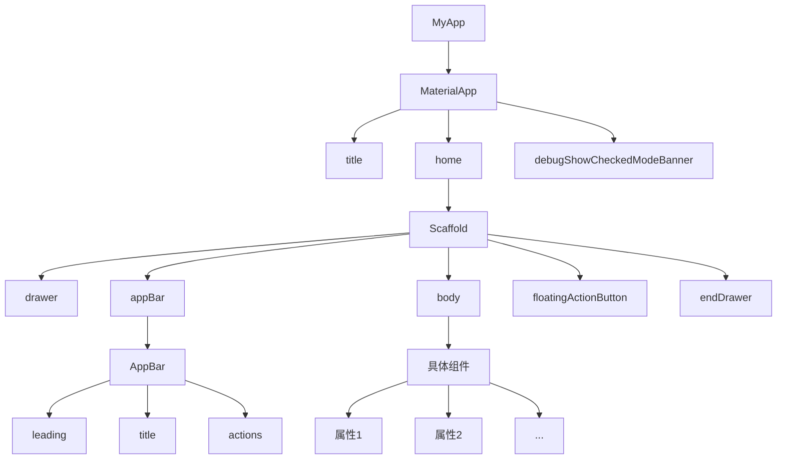

# Flutter学习

[toc]

Flutter中一切内容都是组件（Widget）

- 无状态组件（StatelessWidget）
- 有状态组件（StatefulWidget）

## 初始化项目

### 创建项目

1. `flutter create myporject`
2. `cd myproject`
3. `flutter run`

### 项目目录

```
flutter_app
|--- android               # 安卓目录
|--- build                 # 构建目录
|--- ios                   # ios目录
|--- lib                   # 开发目录，相当于src目录
|------ mian.dart          # 入口文件，相当于index.js
|--- test                  # 测试目录
|------ .gitignore         # Git提交忽略文件
|--- pubspec.lock          # 项目依赖锁定信息（相当于npm中的package-lock.json）
|--- pubspec.yaml          # 项目依赖配置（相当于npm中的package.json）
```

### Material Desgin

Google推出的前端UI解决方案

官网：https://m3.material.io/

中文网：https://www.mdui.org/design/

## APP 结构

1. MaterialApp - Material Design提供的骨架

- title（任务管理器中的标题）
- home（主内容）
- debugShowCheckedModeBanner（是否显示左上角调试标记）

2. Scaffold - 脚手架（骨架）

- appBar（应用头部）
- body（应用主体）
- floatingActionButton（浮动按钮）
- drawer（左侧抽屉菜单）
- endDrawer（右侧抽屉菜单）



MaterialApp 可以看成顶级组件

Scaffold 骨架组件，支撑了APP的骨架

头部的AppBar

body的具体组件

## 基础组件

### Text（文本）

- TextDirection 文本方向
- TextStyle 文本样式
  - Colors 文本颜色
  - FontWeight 字体粗细
  - FontStyle 字体样式
- TextAlign 文本对齐
- TextOverflow 文本溢出
- maxLines 指定显示的行数

RichText 与 TextSpan 一般组合在一起使用，作用是给一段文本声明多个不同的样式。

```dart
  Widget build(BuildContext context) {
    return Column(
      children: [
        const Text(
          "我们在 YouTube 上有一个 Flutter 频道，欢迎订阅！更多视频和播放列表介绍，以及社区制作的视频教程，可以查看我们的 Flutter 技术视频资源 页面。同时，你可以关注 “Google中国”的哔哩哔哩账号 了解更多更全面的谷歌技术中文内容，也可以关注 “Flutter 社区”的哔哩哔哩账号 了解更多来自社区的内容更新。",
          textDirection: TextDirection.ltr,
          style: TextStyle(
            fontSize: 30,
            color: Colors.red,
            fontWeight: FontWeight.w500,
            fontStyle: FontStyle.italic,
            decoration: TextDecoration.lineThrough,
            decorationColor: Colors.blue,
          ),
          textAlign: TextAlign.left,
          maxLines: 3,
          overflow: TextOverflow.ellipsis,
          textScaler: TextScaler.linear(1.5),
        ),
        RichText(
            text: const TextSpan(
                text: "Hello",
                style: TextStyle(fontSize: 40, color: Colors.red),
                children: [
                  TextSpan(
                    text: "Flutter",
                    style: TextStyle(fontSize: 40, color: Colors.blue),
                  ),
                  TextSpan(
                    text: "你好世界",
                    style: TextStyle(fontSize: 30, color: Colors.black45),
                  )
                ]
            )
        )
      ],
    );
  }
```

#### 设置定义字体

下载并导入字体

- Google Fonts：https://fonts.google.com/

- 将下载的字体文件复制到Flutter项目中

在 pubspec.yaml 中声明字体，基本语法：

```yaml
flutter:
	fonts:
		# family 属性决定了字体的名称，会在 TextStyle 的 fontFamily 属性中用到。
		- family: SourceSansPro
			fonts：
				- assets: fonts/Source_Sans_Pro/SourceSans3-Black.ttf
				- assets: fonts/Source_Sans_Pro/SourceSans3-BlackItalic.ttf
					# weight 属性指定了文件中字体轮廓的字重为 100 的整数倍
					weight: 400
					# style 属性指定了文件中字体的轮廓是否为 italic 或 normal
					style: normal
```

### Icon（图标）

Icon图标也是由Material Desgin icon图标库提供

使用方式：

- Icon(Icons.具体名称)

  ```dart
  Icon(Icons.menu)
  ```

项目中自动给我们集成了Material Desgin的Icon图标库，所以无需额外的下载或配置

### Color（颜色）

Flutter 中通过 ARGB 来来声明颜色。

自定义颜色，下面是自定义颜色的方式：

- const Color(0xFF42A5F5); // 16进制(0x)的ARGB = 透明度(FF) + 六位十六进制颜色值(42A5F5)
- const Color.fromARGB(0xFF, 0x42, 0xA5, 0xF5)
- const Color.fromARGB(255, 66, 165, 245)
- const Color.fromRGBO(66, 165, 245, 1.0) // O = Opacity

Colors 英文字母声明的颜色：

- Colors.red

```dart
RichText(
    text: TextSpan(
        text: "Hello",
        style: const TextStyle(fontSize: 40, color: Color.fromRGBO(255, 0, 0, 1)),
        children: [
          TextSpan(
            text: "Flutter",
            style: TextStyle(fontSize: 40, color: Colors.blue),
          ),
          const TextSpan(
            text: "你好世界",
            style: TextStyle(fontSize: 30, color: Color.fromARGB(0xff, 0x00, 0xff, 0x00)),
          )
        ]
    )
)
```

### Container（布局容器）

chlid 声明子组件

padding（margin）

- EdgeInsets （all(), fromLTRB(), only()）

decoration

- BoxDecoration (边框，圆角，渐变，阴影，背景色，背景图片)

alignment

- Alignment （内容对齐）

transform

- Matrix4 （平移-translate，旋转-rotate，缩放-scale，斜切-skew）

```dart
class ContainerDemo extends StatelessWidget {
  const ContainerDemo({super.key});

  @override
  Widget build(BuildContext context) {
    return Container(
      width: 200,
      height: 200,
      // width: double.infinity, // 占满父容器宽度
      // height: double.infinity, // 占满父容器高度
      padding: const EdgeInsets.all(10),
      margin: const EdgeInsets.fromLTRB(10, 30, 0, 5),
      decoration: BoxDecoration(
        border: Border.all(color: Colors.red, width: 10),
        // border: Border(
        //   top: BorderSide(color: Colors.red, width: 10),
        //   bottom: BorderSide(color: Colors.red, width: 10),
        //   left: BorderSide(color: Colors.red, width: 10),
        //   right: BorderSide(color: Colors.red, width: 10),
        // ),
        // borderRadius必须在boder颜色均匀(四边颜色一直)时才会生效
        // borderRadius: BorderRadius.all(Radius.circular(10)),
        borderRadius: const BorderRadius.only(
          topLeft: Radius.circular(30)
        ),
        color: Colors.lightGreen[100],
        gradient: const LinearGradient(colors: [Colors.lightBlue, Colors.white12]), // 设置了渐变之后，背景色color会失效
      ),
      alignment: Alignment.center,
      // transform: Matrix4.translationValues(100, 0, 0), // 平移
      // transform: Matrix4.rotationZ(-0.1), // 旋转
      transform: Matrix4.skewX(0.2), // 斜切
      child: const Text(
        "我们在 YouTube 上有一个 Flutter 频道，欢迎订阅！更多视频和播放列表介绍，以及社区制作的视频教程，可以查看我们的 Flutter 技术视频资源 页面。",
        style: TextStyle(fontSize: 20),
      )
    );
  }
}
```

### Column & Row（线性布局）

Column

Column 中的主轴方向是垂直方向

- mainAxisAlignment：MainAxisAlignment 主轴对齐方式
- crossAxisAlignment：CrossAxisAlignment 交叉轴对齐方式
- children：内容

Row

Row中主轴方向是水平方向

- 属性与Column一致

```dart
class ColumnRowDemo extends StatelessWidget {
  const ColumnRowDemo({super.key});

  @override
  Widget build(BuildContext context) {
    return Container(
      width: double.infinity,
      color: Colors.lightGreen,
      child: const Column(
        mainAxisAlignment: MainAxisAlignment.spaceEvenly, // 主轴的对齐方式
        crossAxisAlignment: CrossAxisAlignment.center,
        children: [
          Icon(Icons.access_alarm, size: 50),
          Icon(Icons.accessible_forward_outlined, size: 50),
          Icon(Icons.settings, size: 50),
          Icon(Icons.add_box, size: 50),
          Row(
            mainAxisAlignment: MainAxisAlignment.center,
            children: [
              Icon(Icons.access_alarm, size: 50),
              Icon(Icons.accessible_forward_outlined, size: 50),
              Icon(Icons.settings, size: 50),
              Icon(Icons.add_box, size: 50),
            ],
          )
        ],
      ),
    );
  }
}
```

### Flex & Expanded（弹性布局）

Flex

- direction 声明主轴方向
- mainAxisAlignment 声明主轴对齐方式
- textDirection 声明水平方向的排列顺序
- crossAxisAlignment 声明交叉轴对齐方式
- verticalDirection 声明垂直方向的排列顺序
- children 声明子组件

Expanded 可伸缩组件

- flex 声明弹性布局所占比例
- child 声明子组件

```dart
class FlexDemo extends StatelessWidget {
  const FlexDemo({super.key});

  @override
  Widget build(BuildContext context) {
    return Column(
      children: [
        // 验证Expanded
        Row(
          children: [
            Container(
              color: Colors.lightBlue,
              width: 50,
              height: 50,
            ),
            Expanded(
                child: Container(
              color: Colors.lightGreen,
              height: 50,
            ))
          ],
        ),
        const Flex(
          direction: Axis.horizontal,
          mainAxisAlignment: MainAxisAlignment.spaceAround,
          textDirection: TextDirection.rtl, // 声明水平方向排列方式
          children: [
            Icon(Icons.access_alarm, size: 50),
            Icon(Icons.accessible_forward_outlined, size: 50),
            Icon(Icons.settings, size: 50),
            Icon(Icons.add_box, size: 50),
          ],
        ),
        Flex(
          direction: Axis.horizontal,
          children: [
            Expanded(
              child: Container(
                color: Colors.tealAccent,
                height: 50,
              ),
              flex: 2,
            ),
            Expanded(
              child: Container(
                color: Colors.amberAccent,
                height: 50,
              ),
              flex: 1,
            )
          ],
        ),
        Container(
          height: 100,
          margin: EdgeInsets.all(50),
          child: Flex(
            direction: Axis.vertical,
            // verticalDirection: VerticalDirection.up, // 垂直方向排列顺序
            children: [
              Expanded(
                child: Container(
                  color: Colors.tealAccent,
                  height: 50,
                ),
                flex: 2,
              ),
              // 空行占位
              Spacer(
                flex: 1,
              ),
              Expanded(
                child: Container(
                  color: Colors.amberAccent,
                  height: 50,
                ),
                flex: 1,
              )
            ],
          ),
        )
      ],
    );
  }
}
```

### Wrap (流式布局)

Wrap（解决内容溢出的问题）

- spacing 主轴方向子组件的间距
- alignment 主轴方向的对齐方式
- runSpacing 纵轴方向子组件的间距
- runAlignment 纵轴方向的对齐方式

顺带学的小组件：Chip（标签），CircleAvatar（圆形头像）

```dart
class WrapDemo extends StatelessWidget {
  const WrapDemo({super.key});

  @override
  Widget build(BuildContext context) {
    List<String> _list = [
      '曹操', '司马懿', '曹仁', '曹洪', '张辽', '许诸'
    ];

    List<Chip> _weiGuo() {
      return _list.map((item){
        return Chip(
          avatar: const CircleAvatar(
            backgroundColor: Colors.black,
            child: Text("魏", style: TextStyle(fontSize: 12, color: Colors.white),),
          ),
          label: Text(item),
        );
      }).toList();
    }

    return Column(
      mainAxisAlignment: MainAxisAlignment.spaceEvenly,
      children: [
        Wrap(
          spacing: 18, // 水平间距
          runSpacing: 15, // 垂直间距
          alignment: WrapAlignment.spaceAround, // 主轴对齐方式
          // runAlignment: WrapAlignment.spaceAround, // 交叉轴对齐方式【已经在column里了，效果不是很明显】
          children: _weiGuo(),
        ),
        const Wrap(
          children: [
            Chip(
              avatar: CircleAvatar(
                backgroundColor: Colors.blue,
                child: Text("蜀"),
              ),
              label: Text("刘备"),
            ),
            Chip(
              avatar: CircleAvatar(
                backgroundColor: Colors.blue,
                child: Text("蜀"),
              ),
              label: Text("张飞"),
            ),
            Chip(
              avatar: CircleAvatar(
                backgroundColor: Colors.blue,
                child: Text("蜀"),
              ),
              label: Text("关羽"),
            ),
            Chip(
              avatar: CircleAvatar(
                backgroundColor: Colors.blue,
                child: Text("蜀"),
              ),
              label: Text("赵云"),
            ),
            Chip(
              avatar: CircleAvatar(
                backgroundColor: Colors.blue,
                child: Text("蜀"),
              ),
              label: Text("诸葛亮"),
            ),
            Chip(
              avatar: CircleAvatar(
                backgroundColor: Colors.blue,
                child: Text("蜀"),
              ),
              label: Text("黄忠"),
            )
          ],
        )
      ],
    );
  }
}
```

### Stack（层叠布局）

Stack 层叠组件 - 类似css中的 z-index

- alignment 声明未定位子组件的对齐方式
- textDirection 声明未定位子组件的排列顺序

Positioned 绝对定位组件

- child 声明子组件
- left，top，right，bottom
- width，height

顺带学的组件：NetworkImage 网络图片组件

- NetworkImage('网络图片地址')
- 配置网络权限: `<uses-permission android:name="android.permission.INTERNET"/>`

```dart
class StackDemo extends StatelessWidget {
  const StackDemo({super.key});

  @override
  Widget build(BuildContext context) {
    return Container(
      child: Stack(
        // 声明未定位子组件排序方式
        textDirection: TextDirection.rtl,
        // 声明未定位子组件对齐方式
        alignment: AlignmentDirectional.bottomCenter,
        children: [
          const CircleAvatar(
            backgroundImage: NetworkImage(
                'https://himg.bdimg.com/sys/portrait/item/public.1.f02d5419.4lnYMc1vGvDDmM9ZRgs5JQ.jpg'),
            radius: 200,
          ),
          Positioned(
            top: 50,
            right: 40,
            child: Container(
              color: Colors.red,
              padding: const EdgeInsets.all(10),
              child: const Text(
                '热卖',
                style: TextStyle(color: Colors.white, fontSize: 20),
              ),
            ),
          ),
          const Text(
            'Hello',
            style: TextStyle(color: Colors.white, fontSize: 50),
          ),
        ],
      ),
    );
  }
}
```

### Card（卡片）

Card 卡片

- child 子组件
- color 背景色
- shadowColor 阴影色
- elevation 阴影高度
- shape 边框样式
- margin 外边距

ListTile 列表瓦片

- leading 头部组件
- title 标题
- subtitle 子标题

```dart
class CardDemo extends StatelessWidget {
  const CardDemo({super.key});

  @override
  Widget build(BuildContext context) {
    return Column(
      children: [
        Card(
          margin: EdgeInsets.all(30),
          color: Colors.purpleAccent[100],
          shadowColor: Colors.yellow,
          elevation: 20,
          shape: RoundedRectangleBorder(
              borderRadius: BorderRadius.circular(40),
              side: BorderSide(color: Colors.yellow, width: 3)),
          child: Column(
            children: [
              ListTile(
                leading: Icon(Icons.supervised_user_circle, size: 50),
                title: Text(
                  "张三",
                  style: TextStyle(fontSize: 30),
                ),
                subtitle: Text(
                  "董事长",
                  style: TextStyle(fontSize: 20),
                ),
              ),
              Divider(),
              ListTile(
                title: Text(
                  "电话: 13333333333",
                  style: TextStyle(fontSize: 20),
                ),
              ),
              ListTile(
                title: Text(
                  "地址:xxxxxxxx",
                  style: TextStyle(fontSize: 20),
                ),
              )
            ],
          ),
        ),
        Card(
          margin: EdgeInsets.all(30),
          child: Column(
            children: [
              ListTile(
                leading: Icon(Icons.supervised_user_circle, size: 50),
                title: Text(
                  "李四",
                  style: TextStyle(fontSize: 30),
                ),
                subtitle: Text(
                  "总经理",
                  style: TextStyle(fontSize: 20),
                ),
              ),
              Divider(),
              ListTile(
                title: Text(
                  "电话: 13333333333",
                  style: TextStyle(fontSize: 20),
                ),
              ),
              ListTile(
                title: Text(
                  "地址:xxxxxxxx",
                  style: TextStyle(fontSize: 20),
                ),
              )
            ],
          ),
        )
      ],
    );
  }
}
```

